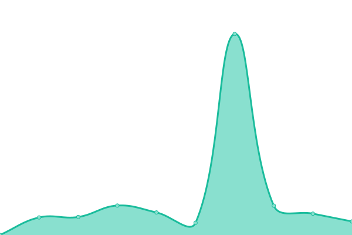

# [📈 Live Status](https://openvoiceos.github.io/status): <!--live status--> **🟧 Partial outage**

This repository contains the open-source uptime monitor and status page for [Open Voice OS](https://openvoiceos.org), powered by [Upptime](https://github.com/upptime/upptime).

With [Upptime](https://upptime.js.org), you can get your own unlimited and free uptime monitor and status page, powered entirely by a GitHub repository. We use [Issues](https://github.com/smartgic/status/issues) as incident reports, [Actions](https://github.com/smartgic/status/actions) as uptime monitors, and [Pages](https://smartgic.github.io/status) for the status page.

<!--start: status pages-->
<!-- This summary is generated by Upptime (https://github.com/upptime/upptime) -->
<!-- Do not edit this manually, your changes will be overwritten -->
<!-- prettier-ignore -->
| URL | Status | History | Response Time | Uptime |
| --- | ------ | ------- | ------------- | ------ |
|  [Text-to-Speech - Mimic3 - Blue Systems](http://mycroft.blue-systems.com:59125/api/healthcheck) | 🟩 Up | [text-to-speech-mimic3-blue-systems.yml](https://github.com/OpenVoiceOS/status/commits/HEAD/history/text-to-speech-mimic3-blue-systems.yml) | 

 515ms
     
 | 

<a href="https://openvoiceos.github.io/status/history/text-to-speech-mimic3-blue-systems">100.00%</a>
    

|  [Text-to-Speech - Mimic3 - Ziggyai](https://mimic3.ziggyai.online/status) | 🟩 Up | [text-to-speech-mimic3-ziggyai.yml](https://github.com/OpenVoiceOS/status/commits/HEAD/history/text-to-speech-mimic3-ziggyai.yml) | 

 293ms
     
 | 

<a href="https://openvoiceos.github.io/status/history/text-to-speech-mimic3-ziggyai">99.81%</a>
    

|  [Text-to-Speech - Piper - Ziggyai](https://pipertts.ziggyai.online/status) | 🟩 Up | [text-to-speech-piper-ziggyai.yml](https://github.com/OpenVoiceOS/status/commits/HEAD/history/text-to-speech-piper-ziggyai.yml) | 

 257ms
     
 | 

<a href="https://openvoiceos.github.io/status/history/text-to-speech-piper-ziggyai">100.00%</a>
    

|  [Text-to-Speech - Mimic - Smart'Gic](https://tts.smartgic.io/mimic/status) | 🟩 Up | [text-to-speech-mimic-smart-gic.yml](https://github.com/OpenVoiceOS/status/commits/HEAD/history/text-to-speech-mimic-smart-gic.yml) | 

 593ms
     
 | 

<a href="https://openvoiceos.github.io/status/history/text-to-speech-mimic-smart-gic">97.59%</a>
    

|  [Text-to-Speech - Mimic3 - Smart'Gic](https://tts.smartgic.io/mimic3/status) | 🟩 Up | [text-to-speech-mimic3-smart-gic.yml](https://github.com/OpenVoiceOS/status/commits/HEAD/history/text-to-speech-mimic3-smart-gic.yml) | 

 74ms
     
 | 

<a href="https://openvoiceos.github.io/status/history/text-to-speech-mimic3-smart-gic">97.60%</a>
    

|  [Text-to-Speech - Piper - Smart'Gic](https://tts.smartgic.io/piper/status) | 🟩 Up | [text-to-speech-piper-smart-gic.yml](https://github.com/OpenVoiceOS/status/commits/HEAD/history/text-to-speech-piper-smart-gic.yml) | 

 65ms
     
 | 

<a href="https://openvoiceos.github.io/status/history/text-to-speech-piper-smart-gic">96.52%</a>
    

|  [Text-to-Speech - SAM - Smart'Gic](https://tts.smartgic.io/sam/status) | 🟩 Up | [text-to-speech-sam-smart-gic.yml](https://github.com/OpenVoiceOS/status/commits/HEAD/history/text-to-speech-sam-smart-gic.yml) | 

 62ms
     
 | 

<a href="https://openvoiceos.github.io/status/history/text-to-speech-sam-smart-gic">97.62%</a>
    

|  [Speech-to-Text - Faster Whisper - Open Voice OS](https://stt.openvoiceos.org/status) | 🟩 Up | [speech-to-text-faster-whisper-open-voice-os.yml](https://github.com/OpenVoiceOS/status/commits/HEAD/history/speech-to-text-faster-whisper-open-voice-os.yml) | 

 316ms
     
 | 

<a href="https://openvoiceos.github.io/status/history/speech-to-text-faster-whisper-open-voice-os">100.00%</a>
    

|  [Speech-to-Text - Faster Whisper - Ziggyai](https://fasterwhisper.ziggyai.online/status) | 🟩 Up | [speech-to-text-faster-whisper-ziggyai.yml](https://github.com/OpenVoiceOS/status/commits/HEAD/history/speech-to-text-faster-whisper-ziggyai.yml) | 

 261ms
     
 | 

<a href="https://openvoiceos.github.io/status/history/speech-to-text-faster-whisper-ziggyai">100.00%</a>
    

|  [Speech-to-Text - Faster Whisper (large-v2) - Smart'Gic](https://stt.smartgic.io/fasterwhisper/status) | 🟩 Up | [speech-to-text-faster-whisper-large-v2-smart-gic.yml](https://github.com/OpenVoiceOS/status/commits/HEAD/history/speech-to-text-faster-whisper-large-v2-smart-gic.yml) | 

 572ms
     
 | 

<a href="https://openvoiceos.github.io/status/history/speech-to-text-faster-whisper-large-v2-smart-gic">97.78%</a>
    

|  [Translator - NLLB - Smart'Gic](https://translator.smartgic.io/nllb/status) | 🟩 Up | [translator-nllb-smart-gic.yml](https://github.com/OpenVoiceOS/status/commits/HEAD/history/translator-nllb-smart-gic.yml) | 

 1892ms
     
 | 

<a href="https://openvoiceos.github.io/status/history/translator-nllb-smart-gic">97.61%</a>
    

|  [Translator - NLLB - Open Voice OS](https://nllb.openvoiceos.org/status) | 🟥 Down | [translator-nllb-open-voice-os.yml](https://github.com/OpenVoiceOS/status/commits/HEAD/history/translator-nllb-open-voice-os.yml) | 

 359ms
     
 | 

<a href="https://openvoiceos.github.io/status/history/translator-nllb-open-voice-os">51.01%</a>
    

|  [Translator - NLLB - Ziggyai](https://ovosnllb.ziggyai.online/status) | 🟩 Up | [translator-nllb-ziggyai.yml](https://github.com/OpenVoiceOS/status/commits/HEAD/history/translator-nllb-ziggyai.yml) | 

 224ms
     
 | 

<a href="https://openvoiceos.github.io/status/history/translator-nllb-ziggyai">100.00%</a>
    

<!--end: status pages-->

[**Visit our status website →**](https://openvoiceos.github.io/status)

## 📄 License

- Powered by: [Upptime](https://github.com/upptime/upptime)
- Code: [MIT](./LICENSE) © [Open Voice OS](https://openvoiceos.org)
- Data in the `./history` directory: [Open Database License](https://opendatacommons.org/licenses/odbl/1-0/)
