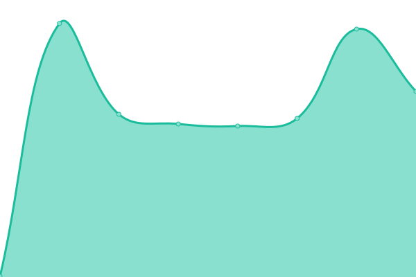
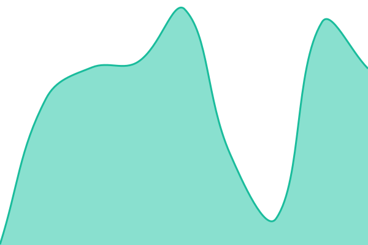
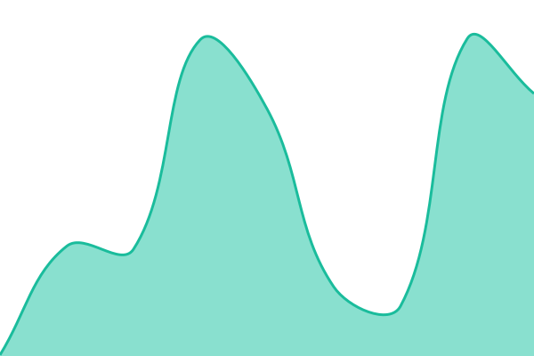
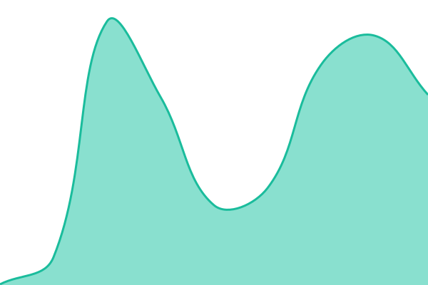

# [📈 Live Status](https://openvoiceos.github.io/status): <!--live status--> **🟧 Partial outage**

This repository contains the open-source uptime monitor and status page for [Open Voice OS](https://openvoiceos.org), powered by [Upptime](https://github.com/upptime/upptime).

With [Upptime](https://upptime.js.org), you can get your own unlimited and free uptime monitor and status page, powered entirely by a GitHub repository. We use [Issues](https://github.com/smartgic/status/issues) as incident reports, [Actions](https://github.com/smartgic/status/actions) as uptime monitors, and [Pages](https://smartgic.github.io/status) for the status page.

<!--start: status pages-->
<!-- This summary is generated by Upptime (https://github.com/upptime/upptime) -->
<!-- Do not edit this manually, your changes will be overwritten -->
<!-- prettier-ignore -->
| URL | Status | History | Response Time | Uptime |
| --- | ------ | ------- | ------------- | ------ |
|  [Text-to-Speech - Piper - Ziggyai](https://pipertts.ziggyai.online/status) | 🟥 Down | [text-to-speech-piper-ziggyai.yml](https://github.com/OpenVoiceOS/status/commits/HEAD/history/text-to-speech-piper-ziggyai.yml) | 

 0ms
     
 | 

<a href="https://openvoiceos.github.io/status/history/text-to-speech-piper-ziggyai">0.00%</a>
    

|  [Text-to-Speech - Matxa - Ziggyai](https://matxa.ziggyai.online/status) | 🟥 Down | [text-to-speech-matxa-ziggyai.yml](https://github.com/OpenVoiceOS/status/commits/HEAD/history/text-to-speech-matxa-ziggyai.yml) | 

 0ms
     
 | 

<a href="https://openvoiceos.github.io/status/history/text-to-speech-matxa-ziggyai">0.00%</a>
    

|  [Text-to-Speech - Mimic - Smart'Gic](https://tts.smartgic.io/mimic/status) | 🟩 Up | [text-to-speech-mimic-smart-gic.yml](https://github.com/OpenVoiceOS/status/commits/HEAD/history/text-to-speech-mimic-smart-gic.yml) | 

 304ms
     
 | 

<a href="https://openvoiceos.github.io/status/history/text-to-speech-mimic-smart-gic">97.55%</a>
    

|  [Text-to-Speech - Piper - Smart'Gic](https://tts.smartgic.io/piper/status) | 🟩 Up | [text-to-speech-piper-smart-gic.yml](https://github.com/OpenVoiceOS/status/commits/HEAD/history/text-to-speech-piper-smart-gic.yml) | 

 200ms
     
 | 

<a href="https://openvoiceos.github.io/status/history/text-to-speech-piper-smart-gic">97.56%</a>
    

|  [Text-to-Speech - SAM - Smart'Gic](https://tts.smartgic.io/sam/status) | 🟩 Up | [text-to-speech-sam-smart-gic.yml](https://github.com/OpenVoiceOS/status/commits/HEAD/history/text-to-speech-sam-smart-gic.yml) | 

 189ms
     
 | 

<a href="https://openvoiceos.github.io/status/history/text-to-speech-sam-smart-gic">97.56%</a>
    

|  [Text-to-Speech - Matxa - Smart'Gic](https://tts.smartgic.io/matxa/status) | 🟩 Up | [text-to-speech-matxa-smart-gic.yml](https://github.com/OpenVoiceOS/status/commits/HEAD/history/text-to-speech-matxa-smart-gic.yml) | 

 134ms
     
 | 

<a href="https://openvoiceos.github.io/status/history/text-to-speech-matxa-smart-gic">97.56%</a>
    

|  [Text-to-Speech - Mimic - TigreGotico](https://mimic.tigregotico.pt/status) | 🟥 Down | [text-to-speech-mimic-tigre-gotico.yml](https://github.com/OpenVoiceOS/status/commits/HEAD/history/text-to-speech-mimic-tigre-gotico.yml) | 

 0ms
     
 | 

<a href="https://openvoiceos.github.io/status/history/text-to-speech-mimic-tigre-gotico">0.00%</a>
    

|  [Text-to-Speech - NOS - TigreGotico](https://nos.tigregotico.pt/status) | 🟥 Down | [text-to-speech-nos-tigre-gotico.yml](https://github.com/OpenVoiceOS/status/commits/HEAD/history/text-to-speech-nos-tigre-gotico.yml) | 

 0ms
     
 | 

<a href="https://openvoiceos.github.io/status/history/text-to-speech-nos-tigre-gotico">0.00%</a>
    

|  [Text-to-Speech - Piper - TigreGotico](https://piper.tigregotico.pt/status) | 🟥 Down | [text-to-speech-piper-tigre-gotico.yml](https://github.com/OpenVoiceOS/status/commits/HEAD/history/text-to-speech-piper-tigre-gotico.yml) | 

 0ms
     
 | 

<a href="https://openvoiceos.github.io/status/history/text-to-speech-piper-tigre-gotico">0.00%</a>
    

|  [Text-to-Speech - Matxa - TigreGotico](https://matxa.tigregotico.pt/status) | 🟥 Down | [text-to-speech-matxa-tigre-gotico.yml](https://github.com/OpenVoiceOS/status/commits/HEAD/history/text-to-speech-matxa-tigre-gotico.yml) | 

 0ms
     
 | 

<a href="https://openvoiceos.github.io/status/history/text-to-speech-matxa-tigre-gotico">0.00%</a>
    

|  [Text-to-Speech - SAM - TigreGotico](https://sam.tigregotico.pt/status) | 🟥 Down | [text-to-speech-sam-tigre-gotico.yml](https://github.com/OpenVoiceOS/status/commits/HEAD/history/text-to-speech-sam-tigre-gotico.yml) | 

 0ms
     
 | 

<a href="https://openvoiceos.github.io/status/history/text-to-speech-sam-tigre-gotico">0.00%</a>
    

|  [Text-to-Speech - Coqui - Neon AI](https://coqui.neonaibeta.com/status) | 🟩 Up | [text-to-speech-coqui-neon-ai.yml](https://github.com/OpenVoiceOS/status/commits/HEAD/history/text-to-speech-coqui-neon-ai.yml) | 

 250ms
     
 | 

<a href="https://openvoiceos.github.io/status/history/text-to-speech-coqui-neon-ai">100.00%</a>
    

|  [Text-to-Speech - Coqui 2 - Neon AI](https://coqui.neonaialpha.com/status) | 🟩 Up | [text-to-speech-coqui-2-neon-ai.yml](https://github.com/OpenVoiceOS/status/commits/HEAD/history/text-to-speech-coqui-2-neon-ai.yml) | 

 252ms
     
 | 

<a href="https://openvoiceos.github.io/status/history/text-to-speech-coqui-2-neon-ai">100.00%</a>
    

|  [Text-to-Speech - Coqui 3 - Neon AI](https://coqui.neonaiservices.com/status) | 🟩 Up | [text-to-speech-coqui-3-neon-ai.yml](https://github.com/OpenVoiceOS/status/commits/HEAD/history/text-to-speech-coqui-3-neon-ai.yml) | 

 239ms
     
 | 

<a href="https://openvoiceos.github.io/status/history/text-to-speech-coqui-3-neon-ai">100.00%</a>
    

|  [Speech-to-Text - Faster Whisper - Ziggyai](https://fasterwhisper.ziggyai.online/status) | 🟥 Down | [speech-to-text-faster-whisper-ziggyai.yml](https://github.com/OpenVoiceOS/status/commits/HEAD/history/speech-to-text-faster-whisper-ziggyai.yml) | 

 0ms
     
 | 

<a href="https://openvoiceos.github.io/status/history/speech-to-text-faster-whisper-ziggyai">0.00%</a>
    

|  [Speech-to-Text - Citrinet - Ziggyai](https://citrinetstt.ziggyai.online/status) | 🟥 Down | [speech-to-text-citrinet-ziggyai.yml](https://github.com/OpenVoiceOS/status/commits/HEAD/history/speech-to-text-citrinet-ziggyai.yml) | 

 0ms
     
 | 

<a href="https://openvoiceos.github.io/status/history/speech-to-text-citrinet-ziggyai">0.00%</a>
    

|  [Speech-to-Text - AINA - Ziggyai](https://ainastt.ziggyai.online/status) | 🟥 Down | [speech-to-text-aina-ziggyai.yml](https://github.com/OpenVoiceOS/status/commits/HEAD/history/speech-to-text-aina-ziggyai.yml) | 

 0ms
     
 | 

<a href="https://openvoiceos.github.io/status/history/speech-to-text-aina-ziggyai">0.00%</a>
    

|  [Speech-to-Text - Faster Whisper - Smart'Gic](https://stt.smartgic.io/fasterwhisper/status) | 🟩 Up | [speech-to-text-faster-whisper-smart-gic.yml](https://github.com/OpenVoiceOS/status/commits/HEAD/history/speech-to-text-faster-whisper-smart-gic.yml) | 

 180ms
     
 | 

<a href="https://openvoiceos.github.io/status/history/speech-to-text-faster-whisper-smart-gic">97.24%</a>
    

|  [Speech-to-Text - Faster Whisper - Neon AI](https://whisper.neonaiservices.com/status) | 🟩 Up | [speech-to-text-faster-whisper-neon-ai.yml](https://github.com/OpenVoiceOS/status/commits/HEAD/history/speech-to-text-faster-whisper-neon-ai.yml) | 

 248ms
     
 | 

<a href="https://openvoiceos.github.io/status/history/speech-to-text-faster-whisper-neon-ai">100.00%</a>
    

|  [Speech-to-Text - AINA - Smart'Gic](https://stt.smartgic.io/aina/status) | 🟩 Up | [speech-to-text-aina-smart-gic.yml](https://github.com/OpenVoiceOS/status/commits/HEAD/history/speech-to-text-aina-smart-gic.yml) | 

 123ms
     
 | 

<a href="https://openvoiceos.github.io/status/history/speech-to-text-aina-smart-gic">97.25%</a>
    

|  [Speech-to-Text - Citrinet - Smart'Gic](https://stt.smartgic.io/citrinet/status) | 🟩 Up | [speech-to-text-citrinet-smart-gic.yml](https://github.com/OpenVoiceOS/status/commits/HEAD/history/speech-to-text-citrinet-smart-gic.yml) | 

 107ms
     
 | 

<a href="https://openvoiceos.github.io/status/history/speech-to-text-citrinet-smart-gic">97.25%</a>
    

|  [Speech-to-Text - NeMo - Neon AI](https://nemo.neonaialpha.com/status) | 🟩 Up | [speech-to-text-ne-mo-neon-ai.yml](https://github.com/OpenVoiceOS/status/commits/HEAD/history/speech-to-text-ne-mo-neon-ai.yml) | 

 210ms
     
 | 

<a href="https://openvoiceos.github.io/status/history/speech-to-text-ne-mo-neon-ai">100.00%</a>
    

|  [Speech-to-Text - Faster Whisper - TigreGotico](https://fasterwhisper.tigregotico.pt/status) | 🟥 Down | [speech-to-text-faster-whisper-tigre-gotico.yml](https://github.com/OpenVoiceOS/status/commits/HEAD/history/speech-to-text-faster-whisper-tigre-gotico.yml) | 

 0ms
     
 | 

<a href="https://openvoiceos.github.io/status/history/speech-to-text-faster-whisper-tigre-gotico">0.00%</a>
    

|  [Speech-to-Text - Citrinet - TigreGotico](https://citrinet.tigregotico.pt/status) | 🟥 Down | [speech-to-text-citrinet-tigre-gotico.yml](https://github.com/OpenVoiceOS/status/commits/HEAD/history/speech-to-text-citrinet-tigre-gotico.yml) | 

 0ms
     
 | 

<a href="https://openvoiceos.github.io/status/history/speech-to-text-citrinet-tigre-gotico">0.00%</a>
    

|  [Speech-to-Text - Chromium - TigreGotico](https://chromium.tigregotico.pt/status) | 🟥 Down | [speech-to-text-chromium-tigre-gotico.yml](https://github.com/OpenVoiceOS/status/commits/HEAD/history/speech-to-text-chromium-tigre-gotico.yml) | 

 0ms
     
 | 

<a href="https://openvoiceos.github.io/status/history/speech-to-text-chromium-tigre-gotico">0.00%</a>
    

|  [Translator - NLLB - Smart'Gic](https://translator.smartgic.io/nllb/status) | 🟩 Up | [translator-nllb-smart-gic.yml](https://github.com/OpenVoiceOS/status/commits/HEAD/history/translator-nllb-smart-gic.yml) | 

 183ms
     
 | 

<a href="https://openvoiceos.github.io/status/history/translator-nllb-smart-gic">97.25%</a>
    

|  [Translator - NLLB - Ziggyai](https://ovosnllb.ziggyai.online/status) | 🟥 Down | [translator-nllb-ziggyai.yml](https://github.com/OpenVoiceOS/status/commits/HEAD/history/translator-nllb-ziggyai.yml) | 

 0ms
     
 | 

<a href="https://openvoiceos.github.io/status/history/translator-nllb-ziggyai">0.00%</a>
    

|  [Translator - NLLB - TigreGotico](https://nllb.tigregotico.pt/status) | 🟥 Down | [translator-nllb-tigre-gotico.yml](https://github.com/OpenVoiceOS/status/commits/HEAD/history/translator-nllb-tigre-gotico.yml) | 

 0ms
     
 | 

<a href="https://openvoiceos.github.io/status/history/translator-nllb-tigre-gotico">0.00%</a>
    

|  [Translator - Google Translate - TigreGotico](https://google-translate.tigregotico.pt/status) | 🟥 Down | [translator-google-translate-tigre-gotico.yml](https://github.com/OpenVoiceOS/status/commits/HEAD/history/translator-google-translate-tigre-gotico.yml) | 

 0ms
     
 | 

<a href="https://openvoiceos.github.io/status/history/translator-google-translate-tigre-gotico">0.00%</a>
    

<!--end: status pages-->

[**Visit our status website →**](https://openvoiceos.github.io/status)

## 📄 License

- Powered by: [Upptime](https://github.com/upptime/upptime)
- Code: [MIT](./LICENSE) © [Open Voice OS](https://openvoiceos.org)
- Data in the `./history` directory: [Open Database License](https://opendatacommons.org/licenses/odbl/1-0/)
